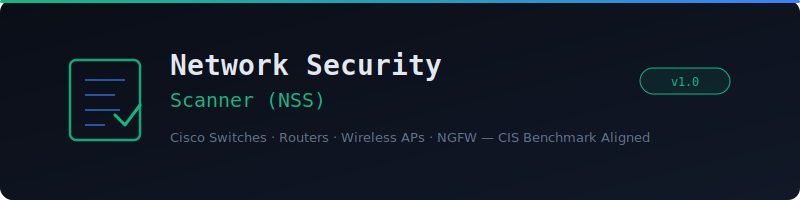

<p align="center">
  
</p>

<p align="center">
  <strong>A Python-based security scanner for Cisco switches, routers, wireless access points, and next-generation firewalls</strong>
</p>

<p align="center">
  
  
  
  
  
  
</p>

---

## Overview

**Network Security Scanner (NSS)** parses Cisco device running-config exports and evaluates them against security baselines from CIS Benchmarks, Cisco hardening guides, and NSA Firepower guidance. It produces an interactive HTML dashboard with findings, severity ratings, and actionable remediation commands.

- **Offline config analysis** — no SNMP, SSH, or API access to devices required
- **Multi-device** — scan router, switch, WAP, ASA, FTD, Nexus, and WLC configs in one run
- **Zero dependencies** — Python 3.8+ stdlib only
- **168+ security checks** across 11 audit modules (128 hardening + 40 CVE matches)
- **CIS Benchmark aligned** — mapped to CIS Cisco IOS/IOS-XE and FTD benchmarks
- **CVE Detection** — 40 curated Cisco PSIRT advisories (2018–2026) with auto version-train matching across IOS, IOS-XE, NX-OS, ASA, FTD, WLC

---

## Supported Devices

| Platform | Config Source | Auto-Detection |
|----------|-------------|----------------|
| Cisco IOS Routers | `show running-config` | ✅ |
| Cisco IOS-XE (Catalyst) | `show running-config` | ✅ |
| Cisco NX-OS (Nexus) | `show running-config` | ✅ |
| Cisco Firepower / FTD | `show running-config` or FMC export | ✅ |
| Cisco WLC (AireOS/C9800) | `show run-config` / `show running-config` | ✅ |

---

## Audit Modules (11)

| Module | Key | Checks | Focus |
|--------|-----|--------|-------|
| 🔐 **Management Plane** | `mgmt` | 25 | Passwords, AAA, SSH, VTY, banners, HTTP, login protection |
| 🛡️ **Control Plane** | `ctrl` | 11 | CoPP, routing auth (OSPF/BGP/EIGRP), NTP, STP, CDP |
| 🌐 **Data Plane** | `data` | 9 | uRPF, DHCP snooping, DAI, storm control, ICMP, proxy ARP |
| ⚙️ **Services & Protocols** | `services` | 9 | Unused services, SNMP hardening, TCP keepalives, timestamps |
| 🔒 **Switch Security** | `switch` | 8 | Port security, VLAN, trunk, DTP, BPDU guard, IP source guard |
| 📡 **Wireless Security** | `wireless` | 10 | SSID encryption, WPA2/3, rogue AP, MFP, WLC management |
| 🔥 **NGFW Core** | `ngfw` | 9 | Access control, IPS, AMP, Security Intelligence, SSL decrypt |
| 🔑 **NGFW Platform** | `ngfwplat` | 7 | FTD mgmt access, accounts, FXOS version, DNS inspection |
| 📊 **Logging & Monitoring** | `logging` | 10 | Syslog, buffered logging, SNMP traps, NetFlow, archive |
| 🔐 **Cryptographic** | `crypto` | 10 | SSH keys, ciphers, TLS versions, IPsec, ISAKMP, DH groups |
| 🚨 **CVE Detection** | `cve` | 40 | Published Cisco PSIRT advisories — ArcaneDoor, BadCandy, Velvet Ant, SNMP RCE, WLC AP-image RCE |

---

## Quick Start

```bash
git clone https://github.com/Krishcalin/Network-Security-Scanner-NSS.git
cd Network-Security-Scanner-NSS

# Scan sample configs (included)
python nss_scanner.py --data-dir ./sample_configs --output report.html

# Scan your own device configs
python nss_scanner.py --data-dir /path/to/configs --output audit_report.html

# Scan specific modules only
python nss_scanner.py --data-dir ./configs --modules mgmt ctrl crypto

# Filter by severity
python nss_scanner.py --data-dir ./configs --severity HIGH
```

### Exporting Configs from Devices

```
! Router/Switch (IOS/IOS-XE)
Router# terminal length 0
Router# show running-config

! Nexus (NX-OS)
Nexus# show running-config

! Firepower FTD (via CLI)
> show running-config

! WLC (AireOS)
(WLC) > show run-config
```

Save each output as a `.cfg`, `.txt`, or `.conf` file in your data directory.

---

## Available Modules

```
mgmt      — Management Plane (passwords, AAA, SSH, VTY, banners)
ctrl      — Control Plane (CoPP, routing auth, NTP, STP, CDP)
data      — Data Plane (uRPF, DHCP snooping, DAI, storm control)
services  — Services & Protocols (SNMP, unused services, timestamps)
switch    — Switch-Specific (port security, VLAN, trunk, DTP, BPDU guard)
wireless  — Wireless Security (SSID, WPA, rogue AP, MFP, WLC mgmt)
ngfw      — NGFW Core (access control, IPS, AMP, SI, SSL inspection)
ngfwplat  — NGFW Platform (FTD management, accounts, updates)
logging   — Logging & Monitoring (syslog, SNMP traps, NetFlow)
crypto    — Cryptographic Posture (SSH keys, TLS, IPsec, ISAKMP)
cve       — CVE Detection (auto version-train match against Cisco PSIRT database)
all       — Run everything (default)
```

---

## CVE Detection

The `cve` module matches the device's detected software version against a
curated database of 40 published Cisco PSIRT advisories (2018–2026) covering:

| Platform | Headline CVEs |
|----------|---------------|
| **ASA / FTD** | ArcaneDoor trio (CVE-2025-20333 / 20362 / 20363), persistent local RCE (CVE-2024-20359), WebVPN path traversal (CVE-2020-3452), info-disclosure (CVE-2020-3259), WebVPN double-free (CVE-2018-0101) |
| **IOS / IOS-XE** | BadCandy chain (CVE-2023-20198 + 20273), SNMP RCE (CVE-2025-20352), Wireless AP-image RCE (CVE-2025-20188), GET VPN RCE (CVE-2023-20109) |
| **NX-OS** | Velvet Ant CLI injection (CVE-2024-20399), Python / Bash sandbox escapes (CVE-2024-20271 / 20272), image-signature bypass |
| **WLC** | Catalyst 9800 auth bypass (CVE-2022-20695), IPv6 DoS, CAPWAP DTLS DoS |

Version detection works on the `show version` output included in the config
file (`Cisco IOS XE Software, Version 17.09.04` → train `17.9`; `ASA Version
9.18(2)` → train `9.18`; `Cisco Nexus Operating System (NX-OS) Software,
Version 9.3(11)` → train `9.3`). Make sure to **append `show version`** to
your exported running-config so the CVE module can match.

KEV-listed and actively-exploited CVEs are flagged with a `[KEV-listed]` or
`[actively exploited]` tag in the finding title for prioritisation. Each
finding links to the canonical Cisco PSIRT advisory URL so operators can
resolve the exact patch-level fixed version via Cisco's Software Checker.

**Precision note** — the database uses `major.minor` train granularity (e.g.
`"17.9"`, `"9.18"`) rather than full patch versions. Cisco PSIRT advisory
pages render the "first fixed release" table via JavaScript so the exact
patch-level vulnerability window can't be reliably scraped at scanner build
time. The auditor therefore flags any device running an affected train and
relies on the linked advisory for patch-precise upgrade guidance.

---

## Project Structure

```
Network-Security-Scanner-NSS/
├── nss_scanner.py                  # Main entry point & CLI
├── modules/
│   ├── base.py                     # Config parser & base auditor
│   ├── mgmt_plane.py              # Management Plane checks
│   ├── ctrl_plane.py              # Control Plane checks
│   ├── data_plane.py              # Data Plane checks
│   ├── services.py                # Services & Protocols checks
│   ├── switch_security.py         # Switch-specific checks
│   ├── wireless.py                # Wireless security checks
│   ├── ngfw_core.py               # NGFW core security checks
│   ├── ngfw_platform.py           # NGFW platform checks
│   ├── logging.py                 # Logging & Monitoring checks
│   ├── crypto.py                  # Cryptographic posture checks
│   ├── cve_detection.py           # 40 published Cisco PSIRT CVEs + version matcher
│   └── report_generator.py        # HTML dashboard generator
├── sample_configs/                 # Demo device configs (7 devices, ~290 findings)
│   ├── router_core.cfg            # IOS 15.7 router with classic hardening gaps
│   ├── switch_access.cfg          # IOS access switch with switching weaknesses
│   ├── catalyst_9300_outdated.cfg # IOS-XE 17.9 — BadCandy + SNMP RCE + AP-image RCE
│   ├── nexus_9k_outdated.cfg      # NX-OS 9.3 — Velvet Ant + Python/Bash escapes
│   ├── asa_5516_outdated.cfg      # ASA 9.18 — ArcaneDoor trio + WebVPN exposed
│   ├── wlc_9800_outdated.cfg      # WLC 17.9 — AP-image RCE + WLC auth bypass
│   ├── ftd_firewall.cfg           # FTD 7.2 — ArcaneDoor trio + FTD-specific
│   └── sample_report.html
├── docs/
│   └── banner.svg
├── .gitignore
├── LICENSE
├── CONTRIBUTING.md
└── README.md
```

---

## Requirements

**Python 3.8+** — No external packages required.

## References

- [CIS Cisco IOS 15 Benchmark](https://www.cisecurity.org/benchmark/cisco)
- [CIS Cisco IOS 17.x Benchmark](https://ncp.nist.gov/checklist/1125)
- [CIS Cisco Firepower FTD Benchmark](https://ncp.nist.gov/checklist/1236)
- [Cisco IOS XE Hardening Guide](https://sec.cloudapps.cisco.com/security/center/resources/IOS_XE_hardening)
- [Cisco NX-OS Hardening Guide](https://sec.cloudapps.cisco.com/security/center/resources/securing_nx_os.html)
- [NSA Cisco Firepower Hardening Guide](https://media.defense.gov/2023/Aug/02/2003272858/-1/-1/0/CTR_CISCO_FIREPOWER_HARDENING_GUIDE.PDF)
- [Cisco WLC Security Best Practices](https://www.cisco.com/c/en/us/td/docs/wireless/controller/best-practices/base/b_bp_wlc/security.html)

## Disclaimer

This tool is for **authorized security assessments only**. The scanner performs offline config analysis and does not connect to any network device.

## License

MIT License — see [LICENSE](LICENSE).
